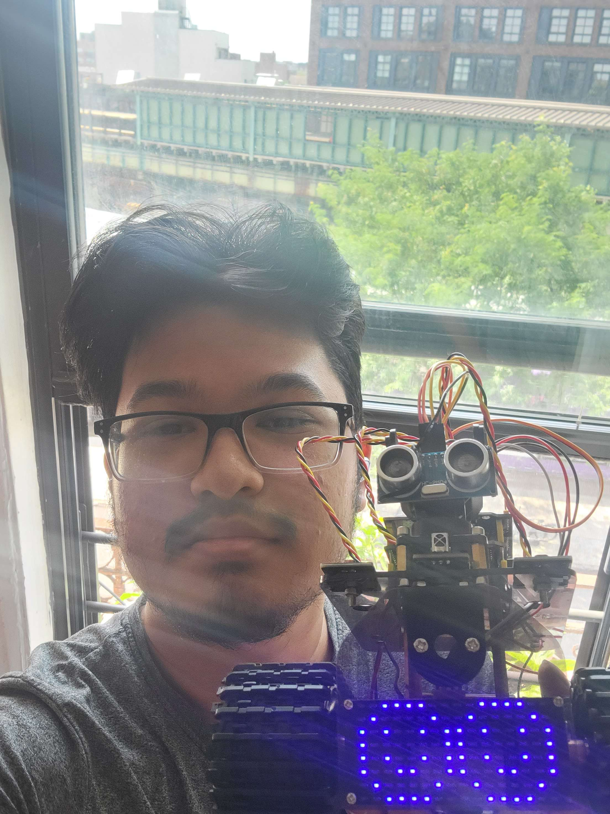

# Mini Tank RC with LED Panel
Hello, this is a RC Tank with an LED panel functionality that I built in which I faced many problems and went above them throughout my three weeks at BlueStamp. At first it was assemblying the parts like the threads, wheels, motors, and the arduino with things like locknuts and screws. Later on after 
assembling I worked on the programming side in order to get the tank to allow inputs from a remote so that it can move and even show patterns on the led panel on the front of the tank

<!-- You should comment out all portions of your portfolio that you have not completed yet, as well as any instructions:
```HTML 
<!--- This is an HTML comment in Markdown -->
<!--- Anything between these symbols will not render on the published site -->
<!-- ``` --> 

| **Engineer** | **School** | **Area of Interest** | **Grade** |
|:--:|:--:|:--:|:--:|
| Tamim K | HS Of Telecommunication Arts & Technology| Computer Science | Incoming Senior

<!-- **Replace the BlueStamp logo below with an image of yourself and your completed project. Follow the guide [here](https://tomcam.github.io/least-github-pages/adding-images-github-pages-site.html) if you need help.** -->


  
# Final Milestone

<iframe width="560" height="315" src="https://www.youtube.com/embed/FY0wbPKkW5g" title="Tamim K. Milestone 3" frameborder="0" allow="accelerometer; autoplay; clipboard-write; encrypted-media; gyroscope; picture-in-picture; web-share" allowfullscreen></iframe>

For my third milestone, I worked on getting the LED panel to work with the IR remote to display patterns once a button is clicked. I managed to accomplish this challenge by using the LED panel test code given in the documentation and tweaking it for my needs with the RC Tank and I had added more statements alongside new long variables to store the hexadecimal input from the IR remote and another variable to store the pattern with them being used in if statements for when a certain button is clicked. Throughout all this succeeded I have faced challenges and succeeded in which one of these challenges would have to be the ir reciever wire being incorrectly for the solution to be that I had to take it out. flip it and then place it back. Another would have to be the long data type as it was foreign to me as, from my prior experience, there wasn't a huge focus on how huge the number should be and, since these remote IR inputs are in hexadecimal, which are huge numbers, using the regular `int` wouldn't work. Throughout all this I got to learn what it was like to be an engineer assembling with some parts having to be put together in a way I didn't expect, like the tank treads needing more force than I expected on the software side, in which I learned another part of programming was prior to coming to bluestamp the only experience I have is with web development and programming between that and working with the arudino is different as shown from what I had said before with the data type but I am happy that I got to learn that as there might be a time where I'll have to learn C++ and learning the arduino which is based off the C++ syntax helps. For the future, I hope I can apply many of these things to other ventures and I hope to learn more of what I'm passionate about as I am to go outside of what I am familar with and I left off with stuff I enjoyed about it familiar which was the software aspect which I want to further myself in. 


# Second Milestone

<iframe width="560" height="315" src="https://www.youtube.com/embed/st0iSvO6ZFY" title="Tamim K. Milestone 2" frameborder="0" allow="accelerometer; autoplay; clipboard-write; encrypted-media; gyroscope; picture-in-picture; web-share" allowfullscreen></iframe>

For my second milestone, I worked on using the IR remote that the kit came with and having it control where the tank goes. I managed to accomplish this by programming it in which I looked at the examples that were given from the documentation which shows how the motors go and it also provided the hexadecimal for the inputs on the remote. With those inputs, I saved them into a variable and made if statements for if this button was pressed it would go this certain way. What was surprising to me is that there was a data type that I wasn't aware of which I had to use for the inputs which were long as it is for hexadecimal as those are huge numbers to store. Besides that, another challenge I had to deal with was with my motor screw being loose with one of the wheels but I managed to get that fixed just fine as it seemed that I didn't do it correctly while assembling it. For my next milestone, I hope to work with the LED panel and also have that respond to inputs just like the motors.
# First Milestone

<iframe width="560" height="315" src="https://www.youtube.com/embed/6IOL5gxTMwA" title="YouTube video player" frameborder="0" allow="accelerometer; autoplay; clipboard-write; encrypted-media; gyroscope; picture-in-picture; web-share" allowfullscreen></iframe>

For my first milestone, I worked on assembling the parts and verifying that uploading code works fine for when I do work on modifications later. With the tank being built with motors and boards like the Arduino and keeping them all together with screws and bolts assembling the tank itself was easy but it did take some time. One of the reasons why it took some time would have been like the tank treads which were shown on the assembly video from the company to be easy to put on but for me, it took some force to put it on. Outside of that issue, I managed to assemble it just fine and I verified that I can upload code by testing the example code for the led and motor control project to see if they would work and they did. For my next steps, I hope to use the motors control on my IR remote so I can make it move wherever and have it stop. 

<!-- # Schematics 
Here's where you'll put images of your schematics. [Tinkercad](https://www.tinkercad.com/blog/official-guide-to-tinkercad-circuits) and [Fritzing](https://fritzing.org/learning/) are both great resoruces to create professional schematic diagrams, though BSE recommends Tinkercad becuase it can be done easily and for free in the browser.  -->

# Code
<!-- Here's where you'll put your code. The syntax below places it into a block of code. Follow the guide [here]([url](https://www.markdownguide.org/extended-syntax/)) to learn how to customize it to your project needs.  -->

```c++
/* keyestudio Mini Tank Robot V2
lesson 6.2
IRremote
http://www.keyestudio.com
*/
#include <IRremoteTank.h>

int RECV_PIN = A0; //define the pin of IR receiver as A0
int LED_PIN = 10; //define the pin of LED

#define SCL_Pin A5 //Set clock pin to A5
#define SDA_Pin A4 //Set data pin to A4


IRrecv irrecv(RECV_PIN);
decode_results results;
#define ML_Ctrl 13 //define the direction control pin of left motor
#define ML_PWM 11 //define the PWM control pin of left motor
#define MR_Ctrl 12 //define direction control pin of right motor
#define MR_PWM 3 // define the PWM control pin of right motor
long up = 0xFF629D;
long left = 0xFF22DD;
long right = 0xFFC23D;
long down = 0xFFA857;
long stop = 0xFF02FD;
long one = 0xFF6897;
long two = 0xFF9867;
long three = 0xFFB04F;
long five = 0xFF18E7;
unsigned char pattern[] = {0x01, 0xff, 0x01, 0xe1, 0x21, 0x41, 0x21, 0xc1, 0x01, 0xe9, 0x04, 0xe6, 0x25, 0x46, 0x24, 0xc8};
unsigned char clear[] = {0x00, 0x00, 0x00, 0x00, 0x00, 0x00, 0x00, 0x00, 0x00, 0x00, 0x00, 0x00, 0x00, 0x00, 0x00, 0x00};;
unsigned char smile[] ={0x3c, 0x42, 0x95, 0xa1, 0xa1, 0x95, 0x42, 0x3c, 0x3c, 0x42, 0x95, 0xa1, 0xa1, 0x95, 0x42, 0x3c};
unsigned char hello[] ={0x7c, 0x10, 0x7c, 0x00, 0x7c, 0x54, 0x54, 0x00, 0x7c, 0x40, 0x00, 0x7c, 0x40, 0x38, 0x44, 0x38};


void setup() {
    Serial.begin(9600);
    irrecv.enableIRIn(); // Initialize the IR receiver 
    pinMode(LED_PIN, OUTPUT); //set LED_pin to OUTPUT
    pinMode(ML_Ctrl, OUTPUT); //define direction control pin of left motor as output
    pinMode(ML_PWM, OUTPUT); //define PWM control pin of left motor as output
    pinMode(MR_Ctrl, OUTPUT); //define direction control pin of right motor as output.
    pinMode(MR_PWM, OUTPUT); //define the PWM control pin of right motor as output
    pinMode(SCL_Pin, OUTPUT);
    pinMode(SDA_Pin, OUTPUT);

}
void loop() {


    if (irrecv.decode( & results)) {
        if (results.value == up) // according to the above key value, press“OK”on remote control , LED will be controlled
        {
            digitalWrite(MR_Ctrl, LOW);
            analogWrite(MR_PWM, 200);
            digitalWrite(ML_Ctrl, LOW);
            analogWrite(ML_PWM, 200);
        } else if (results.value == down) {
            digitalWrite(MR_Ctrl, HIGH);
            analogWrite(MR_PWM, 200);
            digitalWrite(ML_Ctrl, HIGH);
            analogWrite(ML_PWM, 200);
        } else if (results.value == left) {
            digitalWrite(MR_Ctrl, LOW);
            analogWrite(MR_PWM, 170);
            digitalWrite(ML_Ctrl, HIGH);
            analogWrite(ML_PWM, 170);
        } else if (results.value == right) {
            digitalWrite(MR_Ctrl, HIGH);
            analogWrite(MR_PWM, 170);
            digitalWrite(ML_Ctrl, LOW);
            analogWrite(ML_PWM, 170);

        } else if (results.value == stop) {

            digitalWrite(MR_Ctrl, LOW);
            analogWrite(MR_PWM, 0);
            digitalWrite(ML_Ctrl, LOW);
            analogWrite(ML_PWM, 0);
        } else if (results.value == one) {
            matrix_display(pattern);
        } else if (results.value == five) {
            matrix_display(clear);
        } else if (results.value == two) {
            matrix_display(smile);
        } else if (results.value == three) {
            matrix_display(hello);
        }


        irrecv.resume(); //receive the next value
    }
}


// this function is used for dot matrix display 
void matrix_display(unsigned char matrix_value[]) {
    IIC_start();
    IIC_send(0xc0); //Choose address

    for (int i = 0; i < 16; i++) //pattern data has 16 bits
    {
        IIC_send(matrix_value[i]); //convey the pattern data
    }
    IIC_end(); //end the transmission of pattern data
    IIC_start();
    IIC_send(0x8A); //display control, set pulse width to 4/16
    IIC_end();
}
//The condition starting to transmit data
void IIC_start() {
    digitalWrite(SCL_Pin, HIGH);
    delayMicroseconds(3);
    digitalWrite(SDA_Pin, HIGH);
    delayMicroseconds(3);
    digitalWrite(SDA_Pin, LOW);
    delayMicroseconds(3);
}
//convey data
void IIC_send(unsigned char send_data) {
    for (char i = 0; i < 8; i++) //each byte has 8 bits
    {
        digitalWrite(SCL_Pin, LOW); //pull down clock pin SCL Pin to change the signals of SDA
        delayMicroseconds(3);
        if (send_data & 0x01) //set high and low level of SDA_Pin according to 1 or 0 of every bit
        {
            digitalWrite(SDA_Pin, HIGH);
        } else {
            digitalWrite(SDA_Pin, LOW);
        }
        delayMicroseconds(3);
        digitalWrite(SCL_Pin, HIGH); //pull up clock pin SCL_Pin to stop transmitting data
        delayMicroseconds(3);
        send_data = send_data >> 1; // detect bit by bit, so move the data right by one
    }
}
//The sign that data transmission ends
void IIC_end() {
    digitalWrite(SCL_Pin, LOW);
    delayMicroseconds(3);
    digitalWrite(SDA_Pin, LOW);
    delayMicroseconds(3);
    digitalWrite(SCL_Pin, HIGH);
    delayMicroseconds(3);
    digitalWrite(SDA_Pin, HIGH);
    delayMicroseconds(3);
}


//*******************************************************
```

<!-- # Bill of Materials
Here's where you'll list the parts in your project. To add more rows, just copy and paste the example rows below.
Don't forget to place the link of where to buy each component inside the quotation marks in the corresponding row after href =. Follow the guide [here]([url](https://www.markdownguide.org/extended-syntax/)) to learn how to customize this to your project needs. 

| **Part** | **Note** | **Price** | **Link** |
|:--:|:--:|:--:|:--:|
| Item Name | What the item is used for | $Price | <a href="https://www.amazon.com/Arduino-A000066-ARDUINO-UNO-R3/dp/B008GRTSV6/"> Link </a> |
| Item Name | What the item is used for | $Price | <a href="https://www.amazon.com/Arduino-A000066-ARDUINO-UNO-R3/dp/B008GRTSV6/"> Link </a> |
| Item Name | What the item is used for | $Price | <a href="https://www.amazon.com/Arduino-A000066-ARDUINO-UNO-R3/dp/B008GRTSV6/"> Link </a> | -->

# Resources
- [Arduino Reference](https://www.arduino.cc/reference/en/)
- [KeyStudio Mini Tank RC Reference](https://wiki.keyestudio.com/Ks0428_keyestudio_Mini_Tank_Robot_V2)
